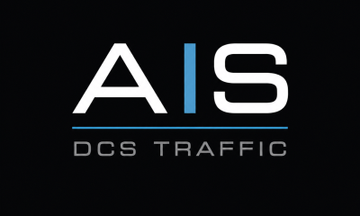
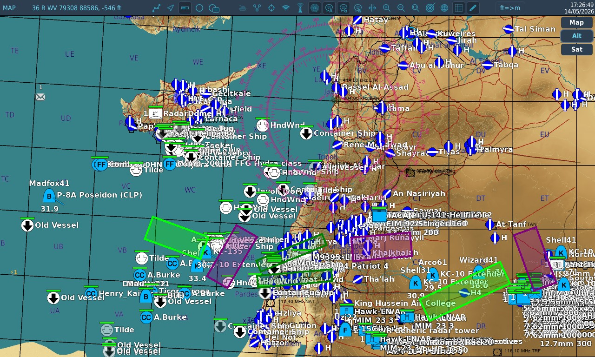
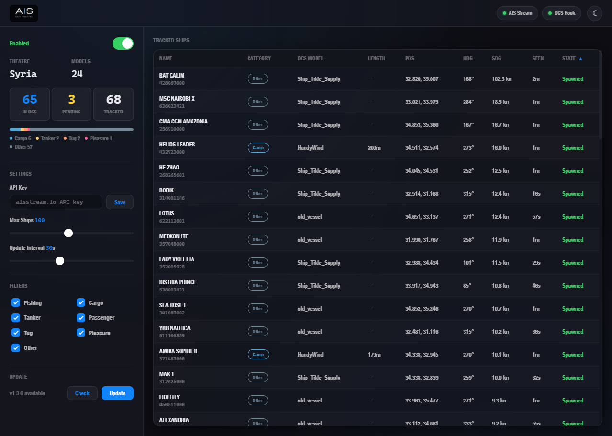
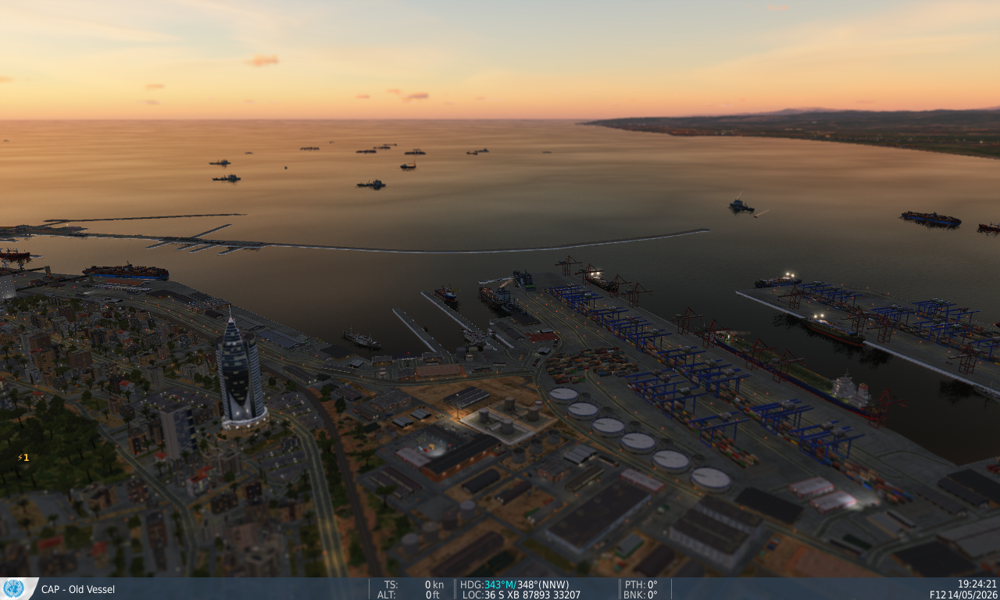
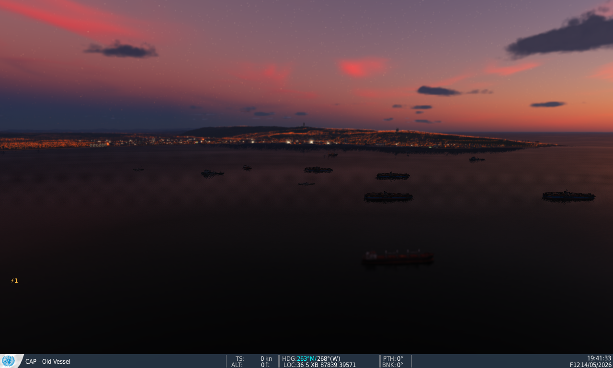
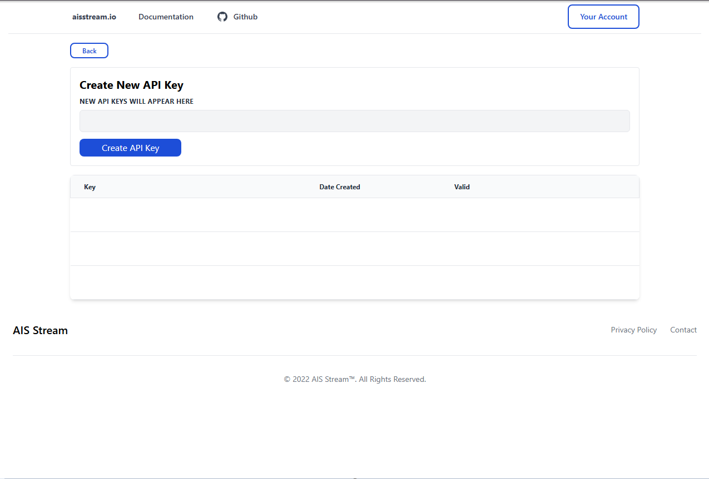

<p align="center">
  
</p>

# DCS AIS Traffic

Real-world ship traffic in DCS World from live AIS data. Ships appear on your F10 map based on what's actually sailing in that part of the world right now.



A Go binary connects to [aisstream.io](https://aisstream.io) for live vessel positions, matches each ship to a DCS model by type and size, and feeds spawn/move commands to a Lua hook inside DCS. Everything is configured through a web dashboard on port 8380. Dark and light modes, your pick.



Ports and harbors end up feeling surprisingly alive. Tugs idle near the breakwater, cargo ships sit at anchor waiting for a berth, tankers drift in the outer roads. You stop noticing it's data after a while.





## How it works

The binary runs alongside DCS as a separate process. It opens a WebSocket to the aisstream.io feed, filters for vessels inside your current DCS map's bounding box, and sends newline-delimited JSON commands over TCP to a Lua hook in your Scripts/Hooks folder.

Ships spawn as neutral coalition (UN Peacekeepers) so they won't engage anyone. Stationary vessels (below 0.5 knots, anchored or moored) spawn as static objects instead of AI groups, which costs less performance. If a ship later starts moving, it converts to an AI group with waypoints. Moving ships get rerouted when their real-world position drifts more than 200 meters or their heading changes by more than 5 degrees.

If you're near the max-ships limit, moving vessels get spawned before anchored ones.

The hook checks DCS terrain before every spawn and drops anything that lands on shore. Ship metadata (name, type, dimensions) is cached to disk so vessels seen before get classified immediately on restart, no need to wait for the next AIS static data broadcast (~6 min cycle).

## Installation

You need DCS World (dedicated server or standalone) and a free API key from [aisstream.io](https://aisstream.io). The [CAP Navy v2.1 mod](https://forum.dcs.world/topic/270558-civilian-objects-and-vehicles/) adds more ship variety but isn't required.

1. **[Download the latest release](https://github.com/deux2k5/dcs-ais-traffic/releases/latest)** and extract the zip somewhere on your DCS machine.

2. Copy `AISTrafficHook.lua` from the extracted folder into your DCS hooks folder:
   ```
   C:\Users\<you>\Saved Games\DCS\Scripts\Hooks\AISTrafficHook.lua
   ```
   On a dedicated server this is usually `Saved Games\DCS.dcs_serverrelease\Scripts\Hooks\`.

3. Run `DCS AIS Traffic.exe`. On first launch it'll ask if you want a desktop shortcut.

4. Start DCS and load any mission.

5. Open `http://localhost:8380` in a browser. Paste your API key, hit Save, flip the toggle to Enabled.

Ships start appearing on the F10 map within a minute or two. AIS always starts disabled on launch, so you need to toggle it on each time.

### Auto-start (optional)

To launch on boot, create a Windows Scheduled Task with "Run whether user is logged on or not" and trigger "At log on." Don't set it up as a Windows Service; the hook needs DCS running in the same session.

### Remote access

The dashboard works from any machine on your network at `http://<server-ip>:8380`.

## Getting your API key

This tool uses [aisstream.io](https://aisstream.io) for live vessel data. It's the only free real-time AIS API with global coverage. Other providers (MarineTraffic, VesselFinder) charge for API access.

To get your key:

1. Go to [aisstream.io](https://aisstream.io) and click **Get Started** (or sign in with GitHub)
2. Once logged in, click **Your Account** in the top right
3. Click **API Keys**
4. Click **Create API Key** and copy the generated key



The key is free with no expiration or rate limits for real-time streaming.

> **Note:** aisstream.io provides terrestrial AIS data only (coastal receiving stations). Ships far from shore won't show up. Coverage is best in busy shipping lanes and near coastlines.

## Supported maps

The tool auto-detects which theatre you're running. AIS data is filtered to a bounding box around each map so you only receive relevant traffic.

- Caucasus (full Black Sea including Istanbul/Bosporus)
- Persian Gulf (including Gulf of Oman)
- Syria (eastern Mediterranean)
- Sinai (Red Sea north + eastern Med)
- Falklands
- Mariana Islands
- Kola (Barents Sea + Norwegian coast)

## Ship models

Ships are matched to DCS models using two things: the AIS type code (cargo, tanker, fishing, etc.) and the vessel's actual length in meters when available. Bigger ships get bigger models. The tool probes your DCS install on startup to see which unit types exist, so it won't try to spawn anything you don't have.

Three sources of models:

- **DCS base game** -- HandyWind (180m), Seawise_Giant (457m), Ship_Tilde_Supply (180m), HarborTug (20m), La_Combattante_II (46m), BDK-775 (112m), CastleClass_01 (74m), leander-gun-ariadne (110m)
- **[CAP Navy v2.1](https://forum.dcs.world/topic/270558-civilian-objects-and-vehicles/)** (mod) -- diesel_trawler (38m), fishing_vessel (50m), trawler_ship (65m), yacht_ship (20m), yacht_helipad (40m), container_ship (180m), old_vessel (100m), ievoli_ivory (190m), lng_tanker (245m), jr_more_tug (65m), akademik_cherskiy (116m), and more
- **Currenthill Assets Pack** -- ALBATROS (71m), CHAP_Project22160 (94m)

The base game ships work fine on their own. CAP Navy adds proper fishing boats, yachts, tankers, tugs, and container ships so things look more accurate.

### How matching works

Each vessel category has length brackets that map to the closest-sized DCS model. When multiple models fit a bracket, one is picked at random. If none of the preferred models are installed, it falls back to Ship_Tilde_Supply, old_vessel, or HandyWind.

| AIS type | Category | Small (<~45m) | Medium (~45-150m) | Large (>~150m) |
|----------|----------|---------------|-------------------|----------------|
| 30 | Fishing | diesel_trawler | fishing_vessel, trawler_ship | -- |
| 31-32, 52 | Tug | HarborTug | jr_more_tug | -- |
| 36-37 | Pleasure | yacht_ship | yacht_helipad | -- |
| 60-69 | Passenger | yacht_ship | yacht_helipad | container_ship, HandyWind |
| 70-79 | Cargo | old_vessel | old_vessel | container_ship, HandyWind |
| 80-89 | Tanker | old_vessel | ievoli_ivory | lng_tanker, Seawise_Giant |
| Other | -- | HarborTug, diesel_trawler | ALBATROS, CastleClass_01, old_vessel | container_ship, akademik_cherskiy |

The "Other" category handles military vessels, SAR, patrol boats, and anything with an unrecognized type code. It has the most granular length brackets since the size range is so wide.

## Updating

The dashboard can update itself. Click "Check" in the Update section at the bottom of the sidebar. If a newer version exists on GitHub, click "Update" and it'll download the new release, swap the exe, and restart. The page reconnects on its own after a few seconds.

## Configuration

The web dashboard at `http://localhost:8380` handles all settings. The underlying file is `config.toml`:

```toml
[ais]
api-key = ""
enabled = false
max-ships = 100       # max simultaneous vessels in DCS (10-200)
update-seconds = 30   # how often to push position updates
stale-minutes = 10    # remove ships not seen for this long

[dcs]
hook-port = 18420

[web]
port = 8380

[filters]
fishing = true
cargo = true
tanker = true
passenger = true
tug = true
pleasure = true
other = true
```

## Web API

All endpoints return JSON.

| Method | Endpoint | Description |
|--------|----------|-------------|
| GET | /api/status | Connection state, ship counts, theatre, categories |
| POST | /api/toggle | `{"enabled": true}` |
| GET | /api/config | Current config (API key redacted) |
| POST | /api/config | Partial config update |
| GET | /api/ships | All tracked vessels with position, type, model, state |
| POST | /api/filters | `{"fishing": true, "cargo": false, ...}` |
| GET | /api/update/check | Check GitHub for a newer release |
| POST | /api/update/apply | Download and install the latest release, then restart |

## Building from source

Requires Go 1.21 or newer.

```bash
git clone https://github.com/deux2k5/dcs-ais-traffic.git
cd dcs-ais-traffic
go build -o "DCS AIS Traffic.exe" ./cmd/dcs-ais-traffic/
```

To embed the application icon on Windows, install [rsrc](https://github.com/akavel/rsrc) and run `rsrc -ico ais-traffic.ico -o cmd/dcs-ais-traffic/rsrc.syso` before building.

The web UI is embedded in the binary via `go:embed`, so the single exe is all you need.

## Troubleshooting

**Ships not appearing:** Check the web dashboard. Both indicator dots (AIS Stream and DCS Hook) should be green. Make sure the Lua hook is in the right Scripts/Hooks folder and DCS was restarted after copying it.

**Ships spawning on land:** The hook checks DCS terrain before spawning, but AIS positions near coastlines can be off by a bit. Should be rare.

**All ships show as "other":** Normal for the first few minutes. AIS type data comes from static data messages which broadcast every ~6 minutes. The cache fills in over time and persists across restarts.

**Hook not connecting:** The exe must be running before or while DCS loads. The hook retries every 5 seconds. Check that port 18420 isn't already in use.

**Wrong map / no ships:** The tool reads the theatre from DCS on mission load. If you installed the hook mid-mission, restart the mission.

## License

MIT
